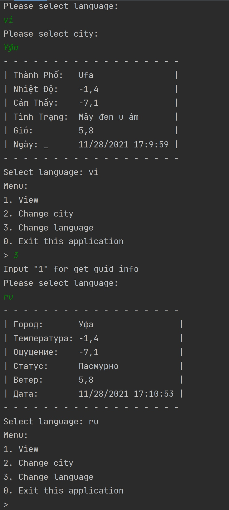

# WeatherEveryDay
Console application on Kotlin(1.6.0) + Ktor, for getting weather information from different cities

## Demonstration of the work



## Used APIs

1. ### Getting the weather forecast

	API: https://openweathermap.org/

2. ### Checking the existence of a city
	
	API: https://www.openstreetmap.org/
	
3. ### Text translation

	API: https://fasttranslator.herokuapp.com/
	
	!Warning: No more than 15 requests per hour!
	
## Used library
	
1. Ktor - for requests
	
2. Gson - to process responses from the server
	
	```
	dependencies {
	
		implementation("io.ktor:ktor-client-core:1.6.5")
		
		implementation("io.ktor:ktor-client-cio:1.6.5")
		
		implementation("com.google.code.gson:gson:2.8.5")
		
	}
	```
	
3. Dokka - For code documentation
	
	```
	plugins {
	
		id("org.jetbrains.dokka") version "1.5.30"
		
	}
	```
	
	
	